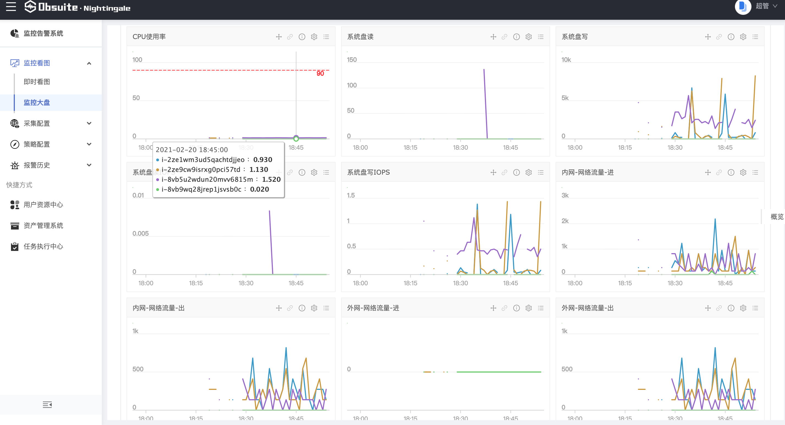
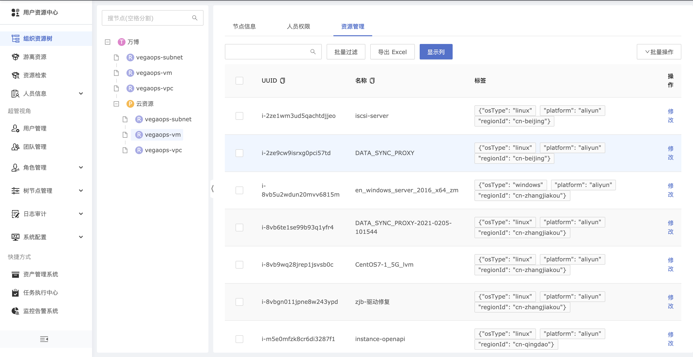

# vegaops2n9e
VegaOps 监控/资产配置 应用




# 快速开始

## 安装夜莺

快速安装，详见：[二进制方式部署](https://n9e.didiyun.com/docs/install/binary/)

## 安装vegaops

Linux及MAC OS，执行命令:

```
curl -L -o - https://gitee.com/openproclouder/vegaops-core/raw/master/quick_install.sh | sh
```

详见：[安装VegaOps](https://github.com/vegaops/vegaops-core#%E5%AE%89%E8%A3%85vegaops)

## 容器快速运行

1. 下载vegaops2n9e源码``git clone https://github.com/vegaops/vegaops2n9e.git``
2. 进入vegaops2n9e ``cd vegaops2n9e``
3. Build 镜像 ``docker build -t vegaops/vegaops2n9e .``
4. 修改配置config.yaml文件中的配置
```
n9e:
  url:
    base: http://192.168.31.174:11180
    rdb: http://192.168.31.174:11180
  token: 9be48eb68cba192a365a290c7cbeb310
```

替换，使用真实的AK/SK
```
  credentials:
    key:      XXXXXX
    secret:   XXXXXX
```

检查真实的n9e节点并替换``nid: 12``

**备注: **n9e nginx配置中，加上
```
        location /v1/rdb {
            proxy_pass http://n9e.rdb;
        }
```
以便可通过API接口直接访问夜莺的rdb，自动将发现的资源进行注册

5. 快速运行``docker run -d -v ./config.yaml:/config.yaml -v /opt/vegaops:/opt/vegaops --name vegaops2n9e vegaops/vegaops2n9e python vegaops2n9e.py``
